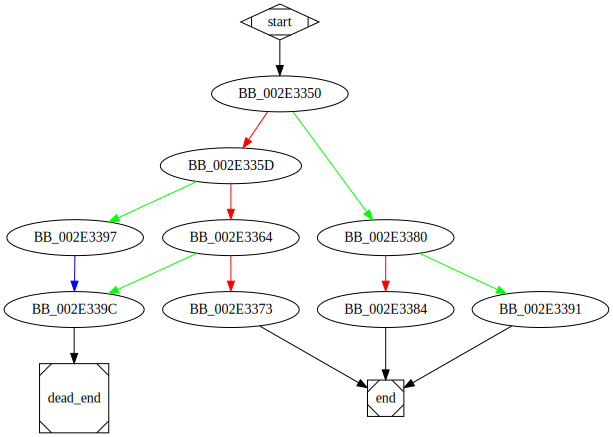

# sub_413350 function

## Tasks

- [ ] Add Description.
- [ ] Add Syntax.
- [ ] Add Assembly.
- [ ] Add Source.
- [ ] Add Arguments.
- [ ] Add Return Value.
- [ ] Add Dependencies.
- [ ] Add Used By.
- [ ] Add Graph.
- [ ] Add Flow.
- [ ] Add Pseudo-code.
- [ ] Fully documented (Including dependencies).

## Description


## Syntax

```c

```

## Assembly

Go to [assembly](../asm/sub_413350.asm).

## Source

Go to [source](../cc/sub_413350.cc).

## Arguments

(Add arguments.)

## Return Value

(Add return value.)

## Dependencies

* Function dependencies:
  * [`??2@YAPAXI@Z`](%3F%3F2%40YAPAXI%40Z.md)
  * [`sub_4129D0`](sub_4129D0.md)
  * [`__invalid_parameter_noinfo_noreturn`](__invalid_parameter_noinfo_noreturn.md)

## Used By

* Used by functions:
  * [`sub_406A50`](sub_406A50.md)

## Graph



