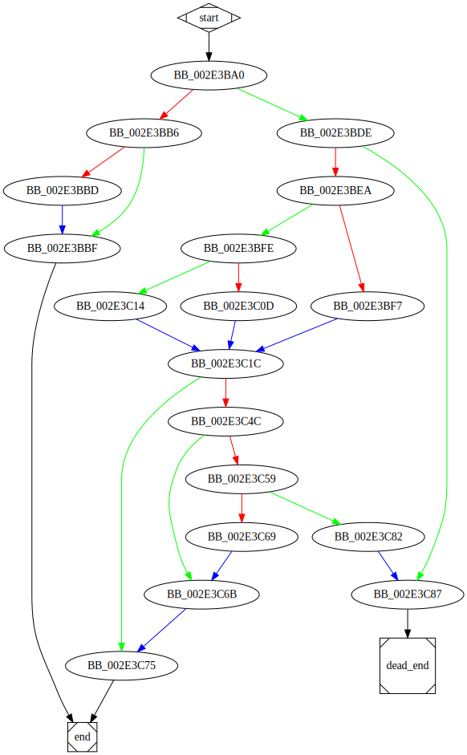

# sub_413BA0 function

## Tasks

- [ ] Add Description.
- [ ] Add Syntax.
- [ ] Add Assembly.
- [ ] Add Source.
- [ ] Add Arguments.
- [ ] Add Return Value.
- [ ] Add Dependencies.
- [ ] Add Used By.
- [ ] Add Graph.
- [ ] Add Flow.
- [ ] Add Pseudo-code.
- [ ] Fully documented (Including dependencies).

## Description

This function is a method of an unknown class.

## Arguments

* `Object` : The object of the method.

## Return Value

(Add return value.)

## Dependencies

* Function dependencies:
  * [`_memmove`](_memmove.md)
  * [`sub_413350`](sub_413350.md)
  * [`sub_43851F`](sub_43851F.md)
  * [`__invalid_parameter_noinfo_noreturn`](__invalid_parameter_noinfo_noreturn.md)
  * [`sub_412ED0`](sub_412ED0.md)

## Graph

