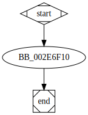

# sub_416F10 function

## Tasks

- [ ] Add Description.
- [ ] Add Syntax.
- [ ] Add Assembly.
- [ ] Add Source.
- [ ] Add Arguments.
- [ ] Add Return Value.
- [ ] Add Dependencies.
- [ ] Add Used By.
- [ ] Add Graph.
- [ ] Add Flow.
- [ ] Add Pseudo-code.
- [ ] Fully documented (Including dependencies).

## Description


## Arguments

* `Object` : The memory address of the object.
* `arg_0` : The first argument.

## Return Value

(Add return value.)

## Dependencies

* Function dependencies:
  * None.

## Used By

* Used by functions:
  * [`_main`](_main.md)

## Graph



## Pseudo-code

### BB_002E6F10

```c
v1 = arg_0;
v2 = Object->Dword04;
v1->Dword00 = v2;
```

