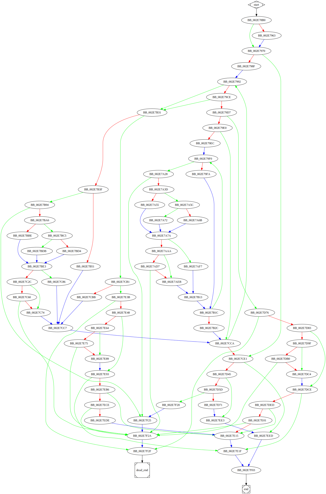

# sub_4178B0 function

## Tasks

- [ ] Add Description.
- [ ] Add Syntax.
- [X] Add Assembly.
- [ ] Add Source.
- [ ] Add Arguments.
- [ ] Add Return Value.
- [ ] Add Dependencies.
- [X] Add Used By.
- [X] Add Graph.
- [ ] Add Flow.
- [ ] Add Pseudo-code.
- [ ] Fully documented (Including dependencies).

## Description

(Add description.)

## Syntax

(Add syntax.)

## Assembly

Go to [assembly](../asm/sub_4178B0.asm).

## Source

Go to [source](../cc/sub_4178B0.cc).

## Arguments

(Add arguments.)

## Return Value

(Add return value.)

## Dependencies

* Function dependencies:
  * [`sub_4137A0`](sub_4137A0.md)
  * [`sub_413480`](sub_413480.md)
  * [`_memmove`](_memmove.md)
  * [`sub_30851F`](sub_30851F.md)
  * [`sub_406BD0`](sub_406BD0.md)
  * [`@__security_check_cookie@4`](@__security_check_cookie@4.md)
  * [`__invalid_parameter_noinfo_noreturn`](__invalid_parameter_noinfo_noreturn.md)
  * [`sub_412ED0`](sub_412ED0.md)
  * [`sub_412A10`](sub_412A10.md)

* Data dependencies:
  * ...

## Used By

* Used by functions:
  * [`sub_417840`](sub_417840.md)

## Graph

## Flow

(Add flow.)

## Pseudo-code

(Add pseudo-code.)

