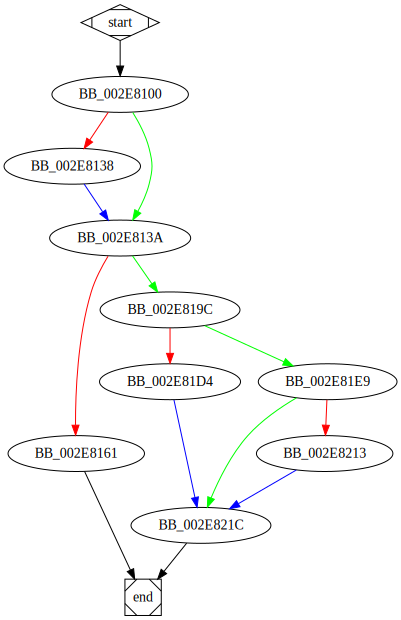

# sub_418100 function

## Tasks

- [ ] Add Description.
- [X] Add Syntax.
- [X] Add Assembly.
- [ ] Add Source.
- [ ] Add Arguments.
- [ ] Add Return Value.
- [X] Add Dependencies.
- [X] Add Used By.
- [X] Add Graph.
- [ ] Add Flow.
- [ ] Add Pseudo-code.
- [ ] Fully documented (Including dependencies).

## Description

(Add description.)

## Syntax

```c
DWORD sub_418100(DWORD arg_0, LPCWSTR lpFileName, DWORD arg_8)
{...}
```

## Assembly

Go to [assembly](../asm/sub_418100.asm).

## Source

Go to [source](../cc/sub_418100.cc).

## Arguments

* `arg_0` : 
* `lpFileName` : 
* `arg_8` : 

## Return Value

(Add return value.)

## Dependencies

* Function dependencies:
  * [`CreateFileW`<sup>Docs</sup>](https://docs.microsoft.com/en-us/windows/win32/api/fileapi/nf-fileapi-createfilew)
  * [`GetLastError`<sup>Docs</sup>](https://docs.microsoft.com/en-us/windows/win32/api/errhandlingapi/nf-errhandlingapi-getlasterror)
  * [`_calloc`](_calloc.md) ⌛
  * [`DeviceIoControl`<sup>Docs</sup>](https://docs.microsoft.com/en-us/windows/win32/api/ioapiset/nf-ioapiset-deviceiocontrol)
  * [`_free`](_free.md) ⌛
  * [`CloseHandle`<sup>Docs</sup>](https://docs.microsoft.com/en-us/windows/win32/api/handleapi/nf-handleapi-closehandle)

* Data dependencies:
  * [`off_487548`](off_487548.md) ⌛

## Used By

* Used by functions:
  * [`sub_41C5E0`](sub_41C5E0.md)

## Graph



## Flow

(Add flow.)

## Pseudo-code

(Add pseudo-code.)
