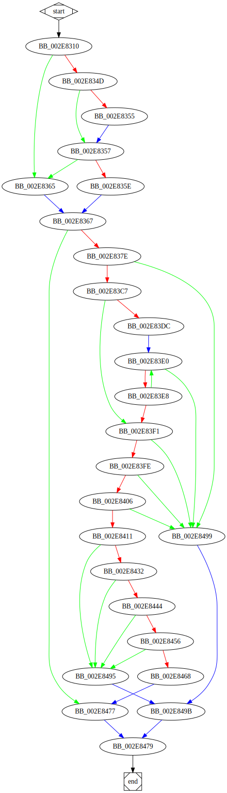

# sub_418310 function

## Tasks

- [ ] Add Description.
- [ ] Add Syntax.
- [X] Add Assembly.
- [ ] Add Source.
- [ ] Add Arguments.
- [ ] Add Return Value.
- [X] Add Dependencies.
- [X] Add Used By.
- [X] Add Graph.
- [ ] Add Flow.
- [ ] Add Pseudo-code.
- [ ] Fully documented (Including dependencies).

## Description

(Add description.)

## Syntax

(Add syntax.)

## Assembly

Go to [assembly](../asm/sub_418310.asm).

## Source

Go to [source](../cc/sub_418310.cc).

## Arguments

(Add arguments.)

## Return Value

(Add return value.)

## Dependencies

* Function dependencies:
  * [`sub_41B8D0`](sub_41B8D0.md) ✅
  * [`sub_416F80`](sub_416F80.md) ❓
  * [`sub_4148F0`](sub_4148F0.md) ❓
  * [`sub_41D290`](sub_41D290.md) ❓
  * [`__wcsicmp`](__wcsicmp.md) ⌛
  * [`sub_40A1A0`](sub_40A1A0.md) ❓
  * [`@__security_check_cookie@4`](@__security_check_cookie@4.md) ⌛
  * [`sub_412C40`](sub_412C40.md) ✅

* Data dependencies:
  * [`aExe`](aExe.md) ⌛
  * [`aCmd`](aCmd.md) ⌛
  * [`aBat`](aBat.md) ⌛
  * [`aCom`](aCom.md) ⌛

## Used By

* Used by functions:
  * [`sub_405180`](sub_405180.md)
  * [`sub_4185D0`](sub_4185D0.md)
  * [`sub_4144B0`](sub_4144B0.md)

## Graph

## Flow

(Add flow.)

## Pseudo-code

(Add pseudo-code.)
