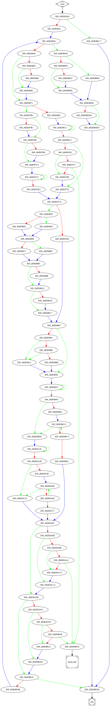

# sub_4185D0 function

## Tasks

- [ ] Add Description.
- [ ] Add Syntax.
- [X] Add Assembly.
- [ ] Add Source.
- [ ] Add Arguments.
- [ ] Add Return Value.
- [X] Add Dependencies.
- [X] Add Used By.
- [X] Add Graph.
- [ ] Add Flow.
- [ ] Add Pseudo-code.
- [ ] Fully documented (Including dependencies).

## Description

(Add description.)

## Syntax

(Add syntax.)

## Assembly

Go to [assembly](../asm/sub_4185D0.asm).

## Source

Go to [source](../cc/sub_4185D0.cc).

## Arguments

(Add arguments.)

## Return Value

(Add return value.)

## Dependencies

* Function dependencies:
  * [`FindNextFileW`Docs](https://docs.microsoft.com/en-us/windows/win32/api/fileapi/nf-fileapi-findnextfilew)
  * [`sub_413C90`](sub_413C90.md) ✔️
  * [`sub_4059F0`](sub_4059F0.md) ❓
  * [`sub_43851F`](sub_43851F.md) ✔️
  * [`sub_41A1C0`](sub_41A1C0.md) ❓
  * [`sub_40B0D0`](sub_40B0D0.md) ❓
  * [`sub_412C40`](sub_412C40.md) ✔️
  * [`sub_41A860`](sub_41A860.md) ❓
  * [`sub_413940`](sub_413940.md) ❓
  * [`sub_413F00`](sub_413F00.md) ❓
  * [`sub_41C5E0`](sub_41C5E0.md) ✔️
  * [`sub_418310`](sub_418310.md) ✔️
  * [`sub_41CE10`](sub_41CE10.md) ✔️
  * [`GetLastError`Docs](https://docs.microsoft.com/en-us/windows/win32/api/errhandlingapi/nf-errhandlingapi-getlasterror)
  * [`FindClose`Docs](https://docs.microsoft.com/en-us/windows/win32/api/fileapi/nf-fileapi-findclose)
  * [`@__security_check_cookie@4`](@__security_check_cookie@4.md) ⌛
  * [`__invalid_parameter_noinfo_noreturn`](__invalid_parameter_noinfo_noreturn.md) ⌛

* Data dependencies:
  * [`off_487548`](off_487548.md) ⌛
  * [`asc_470F88`](asc_470F88.md) ⌛
  * [`asc_470F8C`](asc_470F8C.md) ⌛

## Used By

* Used by functions:
  * [`sub_408450`](sub_408450.md)

## Graph

## Flow

(Add flow.)

## Pseudo-code

(Add pseudo-code.)
