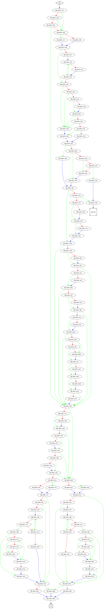

# sub_41A1C0 function

## Tasks

- [ ] Add Description.
- [ ] Add Syntax.
- [X] Add Assembly.
- [ ] Add Source.
- [ ] Add Arguments.
- [ ] Add Return Value.
- [X] Add Dependencies.
- [X] Add Used By.
- [X] Add Graph.
- [ ] Add Flow.
- [ ] Add Pseudo-code.
- [ ] Fully documented (Including dependencies).

## Description

(Add description.)

## Syntax

(Add syntax.)

## Assembly

Go to [assembly](../asm/sub_41A1C0.asm).

## Source

Go to [source](../cc/sub_41A1C0.cc).

## Arguments

(Add arguments.)

## Return Value

(Add return value.)

## Dependencies

* Function dependencies:
  * [`sub_41B8D0`](sub_41B8D0.md) ✔️
  * [`sub_413C90`](sub_413C90.md) ✔️
  * [`sub_405100`](sub_405100.md) ❓
  * [`sub_43851F`](sub_43851F.md) ✔️
  * [`sub_406F70`](sub_406F70.md) ❓
  * [`sub_412C40`](sub_412C40.md) ✔️
  * [`_toupper`](_toupper.md) ⌛
  * [`sub_406D40`](sub_406D40.md) ❓
  * [`_memmove`](_memmove.md) ⌛
  * [`@__security_check_cookie@4`](@__security_check_cookie@4.md) ⌛
  * [`__invalid_parameter_noinfo_noreturn`](__invalid_parameter_noinfo_noreturn.md) ⌛
  * [`sub_412ED0`](sub_412ED0.md) ❓

* Data dependencies:
  * [`asc_470F38`](asc_470F38.md) ✔️
  * [`asc_470F44`](asc_470F44.md) ⌛

## Used By

* Used by functions:
  * [`sub_408A90`](sub_408A90.md)
  * [`sub_4024F0`](sub_4024F0.md)

## Graph

## Flow

(Add flow.)

## Pseudo-code

(Add pseudo-code.)

