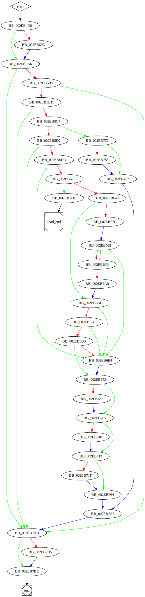

# sub_41B4D0 function

## Tasks

- [ ] Add Description.
- [ ] Add Syntax.
- [X] Add Assembly.
- [ ] Add Source.
- [ ] Add Arguments.
- [ ] Add Return Value.
- [X] Add Dependencies.
- [X] Add Used By.
- [X] Add Graph.
- [ ] Add Flow.
- [ ] Add Pseudo-code.
- [ ] Fully documented (Including dependencies).

## Description

(Add description.)

## Syntax

(Add syntax.)

## Assembly

Go to [assembly](../asm/sub_41B4D0.asm).

## Source

Go to [source](../cc/sub_41B4D0.cc).

## Arguments

(Add arguments.)

## Return Value

(Add return value.)

## Dependencies

* Function dependencies:
  * [`sub_418100`](sub_418100.md) ✅
  * [`_free`](_free.md) ⌛
  * [`sub_406D90`](sub_406D90.md) ❓
  * [`sub_406D40`](sub_406D40.md) ❓
  * [`sub_405100`](sub_405100.md) ❓
  * [`sub_412C40`](sub_412C40.md) ✅
  * [`sub_404730`](sub_404730.md) ❓
  * [`sub_419D30`](sub_419D30.md) ❓
  * [`sub_40B050`](sub_40B050.md) ❓
  * [`sub_40A4B0`](sub_40A4B0.md) ❓
  * [`sub_417F40`](sub_417F40.md) ✅
  * [`@__security_check_cookie@4`](@__security_check_cookie@4.md) ⌛
  * [`sub_412EF0`](sub_412EF0.md) ❓

* Data dependencies:
  * [`asc_340F44`](asc_340F44.md) ⌛

## Used By

* Used by functions:
  * [`sub_41C5E0`](sub_41C5E0.md)

## Graph

## Flow

(Add flow.)

## Pseudo-code

(Add pseudo-code.)
