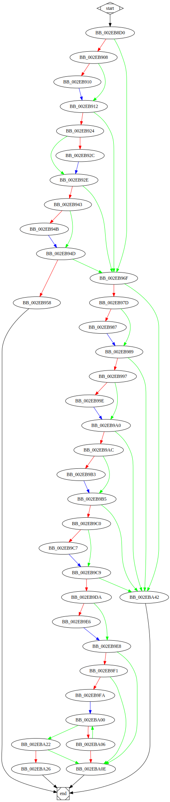

# sub_41B8D0 function

## Tasks

- [ ] Add Description.
- [ ] Add Syntax.
- [X] Add Assembly.
- [ ] Add Source.
- [ ] Add Arguments.
- [ ] Add Return Value.
- [X] Add Dependencies.
- [X] Add Used By.
- [X] Add Graph.
- [ ] Add Flow.
- [ ] Add Pseudo-code.
- [ ] Fully documented (Including dependencies).

## Description

(Add description.)

## Syntax

(Add syntax.)

## Assembly

Go to [assembly](../asm/sub_41B8D0.asm).

## Source

Go to [source](../cc/sub_41B8D0.cc).

## Arguments

(Add arguments.)

## Return Value

(Add return value.)

## Dependencies

* Function dependencies:
  * [`_toupper`](_toupper.md) ⌛
  * [`_isprint`](_isprint.md) ⌛

* Data dependencies:
  * None.

## Used By

* Used by functions:
  * [`sub_418310`](sub_418310.md)

## Graph

## Flow

(Add flow.)

## Pseudo-code

(Add pseudo-code.)
