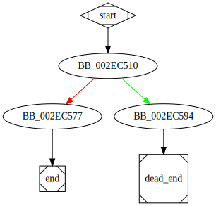

# sub_41C510 function

## Tasks

- [ ] Add Description.
- [ ] Add Syntax.
- [X] Add Assembly.
- [ ] Add Source.
- [ ] Add Arguments.
- [ ] Add Return Value.
- [X] Add Dependencies.
- [X] Add Used By.
- [X] Add Graph.
- [ ] Add Flow.
- [ ] Add Pseudo-code.
- [ ] Fully documented (Including dependencies).

## Description

(Add description.)

## Syntax

(Add syntax.)

## Assembly

Go to [assembly](../asm/sub_41C510.asm).

## Source

Go to [source](../cc/sub_41C510.cc).

## Arguments

(Add arguments.)

## Return Value

(Add return value.)

## Dependencies

* Function dependencies:
  * [`sub_41C5E0`](sub_41C5E0.md) ✅
  * [`@__security_check_cookie@4`](@__security_check_cookie@4.md) ⌛
  * [`sub_402CB0`](sub_402CB0.md) ❓
  * [`sub_4052B0`](sub_4052B0.md) ✅
  * [`sub_4080B0`](sub_4080B0.md) ❓
  * [`sub_3098A0`](sub_3098A0.md) ✅

* Data dependencies:
  * [`off_357548`](off_357548.md) ⌛
  * `__TI5?AVfilesystem_error@filesystem@ghc@@`

## Used By

* Used by functions:
  * [`sub_417120`](sub_417120.md)

## Graph

## Flow

(Add flow.)

## Pseudo-code

(Add pseudo-code.)
