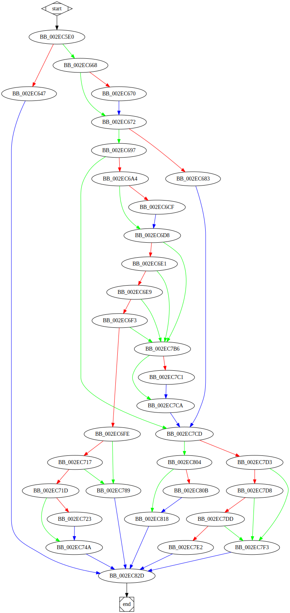

# sub_41C5E0 function

## Tasks

- [ ] Add Description.
- [ ] Add Syntax.
- [X] Add Assembly.
- [ ] Add Source.
- [ ] Add Arguments.
- [ ] Add Return Value.
- [X] Add Dependencies.
- [X] Add Used By.
- [X] Add Graph.
- [ ] Add Flow.
- [ ] Add Pseudo-code.
- [ ] Fully documented (Including dependencies).

## Description

(Add description.)

## Syntax

(Add syntax.)

## Assembly

Go to [assembly](../asm/sub_41C5E0.asm).

## Source

Go to [source](../cc/sub_41C5E0.cc).

## Arguments

(Add arguments.)

## Return Value

(Add return value.)

## Dependencies

* Function dependencies:
  * [`GetFileAttributesExW`Docs](https://docs.microsoft.com/en-us/windows/win32/api/fileapi/nf-fileapi-getfileattributesexw)
  * [`GetLastError`Docs](https://docs.microsoft.com/en-us/windows/win32/api/errhandlingapi/nf-errhandlingapi-getlasterror)
  * [`sub_418100`](sub_418100.md) ✅
  * [`_free`](_free.md) ⌛
  * [`sub_41B4D0`](sub_41B4D0.md) ✅
  * [`sub_405180`](sub_405180.md) ✅
  * `sub_41C5E0` *(Recursion)*
  * [`sub_412C40`](sub_412C40.md) ✅
  * [`@__security_check_cookie@4`](@__security_check_cookie@4.md) ⌛

* Data dependencies:
  * [`off_487548`](off_487548.md) ⌛

## Used By

* Used by functions:
  * [`sub_41C510`](sub_41C510.md)
  * [`sub_4185D0`](sub_4185D0.md)
  * [`sub_4144B0`](sub_4144B0.md)

## Graph

## Flow

(Add flow.)

## Pseudo-code

(Add pseudo-code.)
