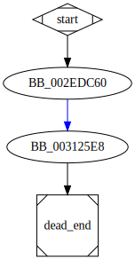

# sub_41DC60 function

## Tasks

- [X] Add Description.
- [X] Add Syntax.
- [X] Add Assembly.
- [ ] Add Source.
- [X] Add Arguments.
- [X] Add Return Value.
- [X] Add Dependencies.
- [X] Add Used By.
- [X] Add Graph.
- [ ] Add Flow.
- [ ] Add Pseudo-code.
- [ ] Fully documented (Including dependencies).

## Description

This function is possibly the function [`gmp_die`<sup>Source</sup>](https://github.com/idris-lang/Idris-dev/blob/master/rts/mini-gmp.c#L246) of the *GMP* library.

## Syntax

```c
static void
gmp_die (const char *msg)
{...}
```

## Assembly

Go to [assembly](../asm/sub_41DC60.asm).

## Source

Go to [source](../cc/sub_41DC60.cc).

## Arguments

`msg` : The error message

## Return Value

None.

## Dependencies

* Function dependencies:
  * [`___acrt_iob_func`](___acrt_iob_func.md) ⌛
  * [`sub_41DC30`](sub_41DC30.md) ⌛
  * [`_abort`](_abort.md) ⌛

* Data dependencies:
  * [`unk_471CA0`](unk_471CA0.md) ⌛

## Used By

* Used by functions:
  * [`sub_4200A0`](sub_4200A0.md)

## Graph



## Flow

(Add flow.)

## Pseudo-code

(Add pseudo-code.)


