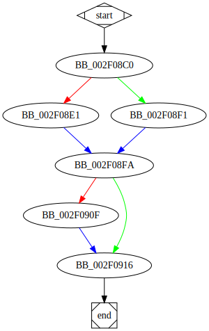

# sub_4208C0 function

## Tasks

- [X] Add Description.
- [X] Add Syntax.
- [X] Add Assembly.
- [ ] Add Source.
- [X] Add Arguments.
- [X] Add Return Value.
- [X] Add Dependencies.
- [X] Add Used By.
- [X] Add Graph.
- [ ] Add Flow.
- [ ] Add Pseudo-code.
- [ ] Fully documented (Including dependencies).

## Description

This function is possibly the function [`mpz_realloc`<sup>Source</sup>](https://github.com/idris-lang/Idris-dev/blob/master/rts/mini-gmp.c#L1454) of the *GMP* library.

## Syntax

```c
static mp_ptr
mpz_realloc (mpz_t r, mp_size_t size)
{...}
```

## Assembly

Go to [assembly](../asm/sub_4208C0.asm).

## Source

Go to [source](../cc/sub_4208C0.cc).

## Arguments

(Add arguments.)

## Return Value

(Add return value.)

## Dependencies

* Function dependencies:
  * [`off_487554`](off_487554.md) ⌛
  * [`off_487550`](off_487550.md) ⌛

* Data dependencies:
  * None.

## Used By

* Used by functions:
  * [`sub_4200A0`](sub_4200A0.md)

## Graph



## Flow

(Add flow.)

## Pseudo-code

(Add pseudo-code.)


