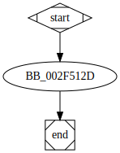

# sub_42512D function

## Tasks

- [ ] Add Description.
- [X] Add Syntax.
- [X] Add Assembly.
- [ ] Add Source.
- [X] Add Arguments.
- [ ] Add Return Value.
- [ ] Add Dependencies.
- [X] Add Used By.
- [X] Add Graph.
- [ ] Add Flow.
- [ ] Add Pseudo-code.
- [ ] Fully documented (Including dependencies).

## Description

(Add description.)

## Syntax

```c
int sub_42512D(wchar_t *FileName, int Mode, int ShFlag)
{...}
```

## Assembly

Go to [assembly](../asm/sub_42512D.asm).

## Source

Go to [source](../cc/sub_42512D.cc).

## Arguments

* `FileName` : 
* `Mode` : 
* `ShFlag` : 

## Return Value

(Add return value.)

## Dependencies

* Function dependencies:
  * [`__wfsopen`](__wfsopen.md) ⌛

* Data dependencies:
  * [`Mode`](Mode.md) ⌛

## Used By

* Used by functions:
  * [`sub_42507E`](sub_42507E.md)

## Graph



## Flow

(Add flow.)

## Pseudo-code

(Add pseudo-code.)


