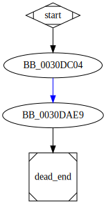

# sub_43DC04 function

## Tasks

- [ ] Add Description.
- [ ] Add Syntax.
- [ ] Add Assembly.
- [ ] Add Source.
- [ ] Add Arguments.
- [ ] Add Return Value.
- [ ] Add Dependencies.
- [ ] Add Used By.
- [ ] Add Graph.
- [ ] Add Flow.
- [ ] Add Pseudo-code.
- [ ] Fully documented (Including dependencies).

## Description

This function jumps to the function [`sub_43DAE9`](sub_43DAE9.md).

## Syntax

```c
DWORD sub_43DC04(CHAR* CommandLine)
{...}
```

## Arguments

* `CommandLine` : The command line that will be executed

## Return Value

(Add return value.)

## Dependencies

* Function dependencies:
  * [`sub_43DAE9`](sub_43DAE9.md)

## Used By

* Used by functions:
  * [`sub_40F650`](sub_40F650.md)

## Graph



