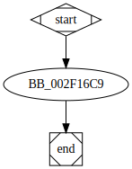

# unknown_libname_5 function

## Tasks

- [ ] Add Description.
- [ ] Add Syntax.
- [X] Add Assembly.
- [ ] Add Source.
- [ ] Add Arguments.
- [ ] Add Return Value.
- [X] Add Dependencies.
- [X] Add Used By.
- [X] Add Graph.
- [ ] Add Flow.
- [ ] Add Pseudo-code.
- [ ] Fully documented (Including dependencies).

## Description

(Add description.)

## Syntax

(Add syntax.)

## Assembly

Go to [assembly](../asm/unknown_libname_5.asm).

## Source

Go to [source](../cc/unknown_libname_5.cc).

## Arguments

(Add arguments.)

## Return Value

(Add return value.)

## Dependencies

* Function dependencies:
  * [`GetNativeSystemInfo`Docs](https://docs.microsoft.com/en-us/windows/win32/api/sysinfoapi/nf-sysinfoapi-getnativesysteminfo)

* Data dependencies:
  * None.

## Used By

* Used by functions:
  * [`sub_2DD790`](sub_2DD790.md)

## Graph

## Flow

(Add flow.)

## Pseudo-code

(Add pseudo-code.)
